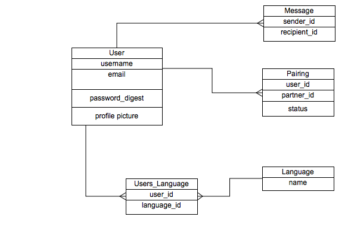

###Project 1 - PEARS

###GA WDI DC September 2014 

**Overview**

Pears is an app where programmers can find other programmers near them, send them pairing requests and meet up to code. 

[Visit Pears](http://codingpears.herokuapp.com)

**Technologies Used**

- Ruby 2.1.2
- Ruby on Rails 4.1.1
- PostgreSQL Database
- User authentication & authorization from Devise gem
- Profile picture functionality from Paperclip gem 
- Testing using rspec-rails, capybara, shoulda-matchers and factory_girl_rails
- CSS styling using SASS

**User Stories Completed** 

- User can sign up / sign in 
- User can have a profile picture
- User can update profile information
- User can look at other users by language
- Use can look at list of available languages (rooms)
- User can have many languages they want to pair in
- User can look at potential partner's profile
- User can send pairing requests / confirm requests 
- User can send private messages to partners

Complete list of user stories [here](https://www.pivotaltracker.com/s/projects/1162604)

**ERD**

Set up
  
    rake db:create
    rake db:migrate
 
